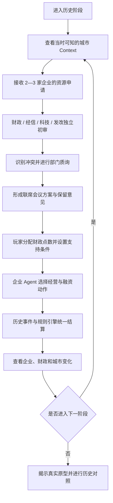

# 合肥产业投资推演系统：产品文档

> 版本：v0.4
>
> 状态：MVP 后端闭环已可运行；前端接入、随访视图和缓存策略待完成
>
> 面向对象：产品、Agent、数据、规则引擎与前端开发成员，以及项目评审人员

## 1. 产品概述

### 1.1 一句话定义

合肥产业投资推演系统是一套政府产业投资决策沙盘。用户扮演合肥市产业投资决策者，在特定历史时点面对多家企业的资金申请，组织财政、经信、科技、发改四个政府部门开展专业研判和联席协商，在有限财政资源下作出投资、配套、追加、重组或退出决策，并观察企业、产业与城市状态如何继续演化。

### 1.2 产品定位

本产品不是产业项目成功率预测器，也不是历史问答工具。它解决的是一个更具体的问题：

> 当政府只能掌握当时已经公开的信息，又必须在多个项目之间分配有限资源时，不同部门会如何判断、争论和妥协；一项决策又会通过企业行动、产业周期和城市路径依赖产生什么后果？

产品以真实历史材料建立决策环境，以政府部门 Agent 模拟专业研判，以企业 Agent 表达企业响应，以确定性规则引擎结算数值，再通过历史回放和反事实比较检验推演机制是否站得住。

### 1.3 用户在扮演谁

用户扮演的是政府最终决策者，而不是企业经营者，也不是站在政府外部的投资顾问。

四个专业 Agent 是政府内部的四个职能部门：

| 政府部门 Agent | 部门目标 | 主要关注 |
| --- | --- | --- |
| 财政部门 | 控制当期支出与长期财政暴露 | 财政余量、资本结构、追加压力、退出条件 |
| 经信部门 | 推动项目落地并形成产业链协同 | 本地产业基础、供应链、人才、基础设施、企业执行 |
| 科技部门 | 判断技术可行性与产业化路径 | 技术成熟度、研发能力、设备与知识产权约束、量产里程碑 |
| 发改部门 | 统筹产业方向、市场周期与长期布局 | 需求周期、产能竞争、政策窗口、城市长期战略 |

四个部门不替用户作出最终决定。它们的职责是揭示不同目标之间的冲突，把笼统的“支持或不支持”转化为带条件的政府方案。

## 2. 用户问题与产品价值

### 2.1 用户面对的真实难题

重大产业投资决策通常同时存在四类困难：

1. 信息不完整：关键财务、技术或市场数据可能尚未公开；
2. 目标不一致：产业价值、财政安全、技术风险和市场时点之间没有单一最优解；
3. 资源相互排斥：支持一个重资产项目，会压缩其他项目及未来阶段的财政空间；
4. 结果具有路径依赖：早期投资既可能形成供应链和人才基础，也可能形成长期追加和沉没成本。

传统案例复盘往往已经知道结果，容易把后见之明当成当时就能作出的判断。单一大模型回答则容易忽略预算守恒、未来信息泄漏和部门利益差异。

### 2.2 产品提供的价值

系统通过五项能力支持用户：

- 还原决策时点：每轮只提供当时可知的信息，不把未来结果混入研判；
- 组织多部门研判：让财政、产业、科技和发展规划目标在同一场景中发生可见冲突；
- 呈现资源机会成本：同一财政池由多家企业竞争，支持一家必然影响其他选择；
- 追踪决策后果：企业状态、财政承诺和城市产业资产会进入下一阶段；
- 提供历史反证：终局比较用户世界线、历史决策路径和真实结果，解释关键分叉而不是仅仅给出相似度。

### 2.3 核心产品主张

> 我们不让 Agent 替政府预测一个答案，而是让政府在当时可知的信息中，看见各部门为什么分歧、什么条件能够促成妥协，以及每个选择会把城市带向哪条路径。

### 2.4 核心产品亮点：历史信息防泄露推演

本产品最有辨识度的设计，不是“收集了很多历史数据”，而是把历史材料拆成两套彼此隔离的信息空间：

- 决策时可见区：只包含截止日前已经公开、且完成来源登记的材料，供玩家和 Agent 使用；
- 终局验证区：保存后来发布的财报、评级报告、项目结果与真实历史路径，只用于 Replay 和审计。

因此，系统不是让 Agent 站在今天解释“为什么合肥当年投对了”，而是让它在不知道后来成功或失败的情况下，面对当时真实存在的不确定性重新选择。这将普通的历史案例展示升级为“可审计的盲测决策实验”。

一句话卖点：

> 我们不是把历史答案喂给 Agent，而是把 Agent 放回历史发生前。

该亮点同时解决三个评审问题：

1. 真实性：Agent 使用的不是创作者编写的剧情，而是当时确实可获得的公开材料；
2. 公平性：成功案例和失败案例都不能依靠结局标签影响运行时判断；
3. 可证伪性：终局揭示 withheld 信息后，可以检查当时判断为何成立、遗漏了什么，以及新增哪条证据会使结论翻转。

### 2.5 核心产品亮点：关键命题穿透

政府不可能在一次决策中消除所有信息缺口。MVP 也不把“信息不对称”作为一个宽泛标签，而是为每个案例锁定一个决定项目能否成立的关键命题：

> 在作出重大投入前，政府有没有识别并穿透最可能改变决策的那个问题；如果仍然无法确认，有没有把风险写进投资条件？

MVP 三个核心案例分别训练一种政府能力：

| 案例 | 决策时容易看到的表象 | 必须穿透的关键命题 | 要学习的合肥逻辑 |
| --- | --- | --- | --- |
| 京东方 | 重资产、行业转弱、财政压力大 | 企业是否具备建线、融资和持续扩代的真实能力？ | 在行业低谷识别经过验证的产业能力，并以资本结构促成项目落地 |
| 赛维 LDK | 龙头企业、行业增长、规划产能可观 | 母公司能否在价格下降和高负债下持续提供运营资金、采购信用和技术人员？ | 不能只看行业增长与项目规模，必须穿透母公司现金和再融资能力 |
| 长鑫 | 国家战略明确、产业价值极高 | 技术团队、知识产权路径和长期资本能否按阶段形成闭环？ | 面对战略性高不确定项目，用长期资本和阶段里程碑管理未知 |

关键命题只有四种产品状态：

- 已验证：存在截止日前可核验的直接证据；
- 部分验证：只有间接证据、区间披露或企业定性回应；
- 未验证：材料缺失或企业拒绝披露；
- 存在矛盾：企业回应与政府已有证据不一致。

玩家不因“未验证”自动失败。真正被评价的是：是否提出了正确问题，以及是否用分期拨付、同比例出资、里程碑、审计或退出条款约束仍未确认的风险。

### 2.6 核心产品亮点：可解释的 Agent Memory

Memory 不以层数作为卖点。产品只保留一个事实图和两本账：

```text
现实图谱：什么已经发生、什么已经被证实
判断账：企业现在相信接下来会怎样
承诺账：政府和企业已经答应了什么
```

企业身份、长期目标、扩张倾向和风险偏好属于“决策底色”，不属于 Memory。一次融资失败、一次项目延期或一次政府履约属于现实图谱中的事件；只有当它改变企业预期时，才更新判断账；只有当双方形成条件时，才写入承诺账。

因此，企业每次行动都可以用同一条链解释：

```text
决策底色
+ 当前可见事实
+ 对未来的判断
+ 尚未履行的承诺
→ 企业的申请、披露、反提案或经营行动
```

这套结构的价值不是让 Agent “记得更多”，而是稳定回答三个问题：当时依据什么判断、为什么后来改变判断、过去的承诺为什么约束了今天的选择。

## 3. 产品世界与推演范围

### 3.1 历史范围

MVP 将 2007—2016 年压缩为四个决策阶段：

| 阶段 | 历史窗口 | 核心矛盾 | 典型决策 |
| --- | --- | --- | --- |
| S1 产业底座 | 2007—2008 | 财政能力有限，逆周期项目出现 | 首投、基础设施配套 |
| S2 扩产抉择 | 2009—2011 | 既有项目要求追加，新项目同时进入 | 追加、引链、拒绝 |
| S3 周期分化 | 2012—2014 | 行业走势分化，部分重资产项目承压 | 止损、重组、继续投入 |
| S4 长期下注 | 2015—2016 | 短期财政回报与长期技术能力冲突 | 组合再平衡、长期投资 |

每个阶段代表一个关键决策窗口，不是对每个自然年度的精确复刻。

### 3.2 企业原型

系统从六类真实历史案例中选择 2—3 家匿名企业进入同一局：

| 企业原型 | 主要检验的机制 |
| --- | --- |
| 大型显示制造 | 逆周期投资、本地客户与产业基础 |
| 半导体存储 | 长周期资本、持续研发与追加压力 |
| 高端装备技术 | 技术可行性与商业化能力 |
| 光伏制造 | 高景气扩产与周期反转 |
| 重型装备 | 重资产风险、本地产业适配与退出损失 |
| 生物医药 | 建设兑现、治理与长期研发风险 |

这些原型共享同一套状态转移规则。历史成功案例不会被写成必胜脚本，历史失败案例也不会被写成必败脚本。

### 3.3 有限财政池

每个阶段的政府资源被归一化为财政点数。财政点数用于表达同一阶段内的资源约束，不等同于现实财政结余或具体亿元数。

```text
本轮可用财政点数
= 阶段新增财力
+ 上轮未使用余额
+ 退出与回收
- 已承诺资本
- 项目维护成本
```

玩家必须在同一财政池中比较多个项目。未获得支持的企业也会继续融资、收缩、等待、迁移或错过窗口，不会被系统冻结。

## 4. 核心产品体验

### 4.1 完整用户旅程



### 4.2 阶段一：进入决策时点

系统首先展示本轮政府能够掌握的城市环境：

- 财政能力与已承诺资本；
- 产业基础、供应链、人才和基础设施；
- 当前市场周期与已经生效的产业政策；
- 本局企业及其资源申请；
- 已知事实、派生指标和仍然缺失的信息。

用户此时看不到企业真实原型名称，也看不到截止日后的投产、营收或成败结果。

### 4.3 阶段二：阅读企业申请

每家企业以匿名项目卡呈现：

- 企业和项目背景；
- 产品、技术及市场情况；
- 财务健康与执行能力；
- 项目资本强度和建设周期；
- 本轮资金请求与支持诉求；
- 当前证据质量和数据缺口。

多个项目必须同时出现，使用户直接感受到机会成本：给企业 A 追加 40 点，意味着留给企业 B、C 及未来项目的资源减少。

### 4.4 阶段三：政府四部门独立初审

四个部门读取同一份冻结事实快照，但使用不同职责、指标和红线形成初审备忘录。每份备忘录至少包含：

- 当前建议：支持、有条件支持、暂缓或反对；
- 核心主张与对应证据；
- 关键假设和缺失信息；
- 部门红线与可接受条件；
- 置信度和最重要风险。

独立初审阶段不允许部门互相看到未提交的意见，避免先发言部门造成锚定。

### 4.5 阶段四：部门质询与联席研判

编排器比较四份备忘录，只对真实存在的分歧触发定向质询。例如：

- 经信部门主张逆周期进入，财政部门追问后续追加上限；
- 发改部门判断市场窗口有利，科技部门要求说明量产证据；
- 科技部门认可技术价值，经信部门追问本地供应链能否承接。

每次沟通必须指向具体主张和证据。被质询部门可以维持、软化或改变立场，也可以明确承认材料不足。联席会议最终输出：

- 已达成的共识；
- 仍未解决的分歧；
- 至少两个可供玩家选择的方案；
- 分期出资、里程碑、配套或退出条件；
- 少数意见和需要继续调查的问题。

冲突识别器和会议秘书属于编排组件，不是拥有额外偏好的第五个部门。会议秘书只整理已出现的判断，不替玩家拍板。

#### 4.5.1 主流程与展开详情

玩家不需要观看四个部门逐段发言。主流程只展示一张联席摘要：

```text
共同判断：项目具备某项战略或产业价值
最大分歧：财政暴露、技术兑现或市场周期
关键未穿透项：本轮最值得向企业追问的问题
建议动作：支持、暂缓、分期或拒绝
```

玩家可以展开查看：

- 四部门各自的初审结论；
- 支撑和反对该结论的证据；
- 部门红线、假设与缺失信息；
- 哪个部门质询了谁；
- 哪个证据导致立场变化；
- 联席会保留的少数意见。

默认折叠保证决策节奏，展开详情保证产品可审计。页面展示的是“争议结构”，而不是聊天气泡数量。

#### 4.5.2 现实依据

政府交互只采用公开材料能够证明的动作，不凭空设计“政府魔法按钮”。京东方案例至少能够支持以下产品交互：项目可行性与风险论证、投资框架协议、项目公司和股东协议、资本金筹集、社会资本协调、项目备案与建设里程碑。合肥建投公开回顾明确提到对项目进行深入了解、可行性分析、风险测算和资金募集方案研究；京东方公告记录了框架协议、项目公司设立及后续项目手续；合肥建投还公开披露了定向增发和社会投资者协调过程。

| 真实动作 | 产品交互 | 证据入口 |
| --- | --- | --- |
| 项目可行性、风险与资金方案研究 | 玩家选择关键核验项 | [合肥建投项目回顾](https://www.hfjtjt.com/col14/547) |
| 签署投资框架协议 | 玩家提交政府条件单 | [京东方项目进展公告](https://static.cninfo.com.cn/finalpage/2008-10-17/44280437.PDF) |
| 协调国资、社会资本和定向增发 | 玩家选择政府资本与融资协调工具 | [合肥建投定向增发回顾](https://www.hfjtjt.com/col14/217) |
| 项目公司、备案、开工和量产 | 系统按里程碑推进时间线 | [京东方 2008 年年报摘要](https://static.cninfo.com.cn/finalpage/2009-04-21/51493003.PDF) |

上述链接用于说明“为什么产品可以这样交互”，不是把现代制度流程反向套入历史。每个案例都必须建立自己的现实动作证据表。

### 4.6 阶段五：玩家形成政府决策

玩家结合部门意见，在企业之间配置资源并选择政府动作：

- 投资；
- 基础设施、人才或供应链配套；
- 融资支持；
- 后续追加；
- 重组；
- 退出。

联席意见只有被玩家转化为具体动作和条件，才会进入结算。自然语言意见本身不能直接修改任何数值。

玩家在一轮中只完成三次主要操作：

1. **选择一个关键核验问题**：从系统根据事实缺口和部门分歧生成的问题卡中选择一张；
2. **提交政府条件单**：配置投入、城市支持和风险条件；
3. **处理一次企业反提案**：接受、修改一次或放弃。

完整协商控制在约 60—90 秒。用户不需要输入长篇政策文本，也不需要观看无限制的 Agent 对话。

关键核验问题只能来自当前案例的“关键未穿透项”，例如：

- 母公司能否持续提供运营资金、技术人员和采购信用；
- 企业是否具备已经验证过的建线、融资和量产能力；
- 技术团队、知识产权路径和长期资本能否形成阶段性闭环。

企业可以完整披露、部分披露、给出区间、以商业秘密为由拒绝，或要求政府先承诺条件。企业可以策略性隐瞒，但不能捏造与已掌握事实冲突的订单、资金和技术成果。

政府条件单只允许使用结构化选项：

| 条件单组件 | 可选内容 |
| --- | --- |
| 政府投入 | 点数、分期、首期上限 |
| 城市支持 | 土地与基础设施、人才、供应链、融资协调 |
| 风险条件 | 资金证明、技术里程碑、审计、同比例出资、暂停追加、退出安排 |

企业反提案只出现一次，可要求提高投入、降低条件、延后里程碑、增加城市配套或拒绝方案。玩家随后确认、修改一次或放弃。

### 4.7 阶段六：企业自主响应

政府决策提交后，每家企业 Agent 根据自身状态、获得的资源和外部环境选择下一步行动：

- 扩建；
- 研发；
- 融资；
- 获取订单；
- 收缩；
- 迁移；
- 等待。

企业 Agent 负责表达“企业想做什么以及为什么”，规则引擎负责判断行动实际完成多少。政府没有支持的企业仍然持续演化。

### 4.8 阶段七：结算与反馈

规则引擎在所有部门和企业完成本轮选择后统一结算：

```text
下一阶段状态
= 上一阶段状态
+ 玩家政府动作
+ 企业自主动作
+ 已发生的历史事件
+ 城市产业协同
+ 路径依赖反馈
```

用户看到的反馈包括：

- 财政余额、承诺资本和维护压力；
- 企业财务、建设、技术、产能、订单和状态变化；
- 产业基础、供应链、人才和公共价值变化；
- 每项变化的原因、输入指标和证据；
- 哪个部门提出了关键条件，哪些分歧仍未解决。

上一轮结果会成为下一轮 Context。早期投资可能形成产业协同，也可能锁定财政并挤压下一阶段机会。

### 4.9 终局历史对照

四阶段结束后，系统揭示企业真实原型，并并列展示：

- 用户决策世界线；
- 合肥历史关键决策路径；
- 真实企业发展结果；
- 两条路径的关键分叉；
- 方向、时序、机制、路径反馈和信息泄漏审计。

终局不以“你比合肥高多少分”为主要表达，而是回答：哪个决策改变了哪个变量，为什么形成不同结果，以及哪些证据变化会让当时的判断翻转。

#### 4.9.1 单线叙事

终局默认只讲一条有故事性的时间线，不把玩家变成观看多条模拟录像的观众。每个阶段保留五个叙事节点：

1. 当时政府知道什么；
2. 政府最担心什么；
3. 企业披露、回避或要求交换了什么；
4. 双方最后承诺了什么；
5. 这个决定后来造成了什么。

页面用一条时间线串起：政府初审、关键核验、企业回应、条件单、反提案、协议状态、里程碑和城市反馈。评分和指标作为时间线旁的解释层出现，不替代故事本身。

#### 4.9.2 关键命题复盘

终局增加“关键命题复盘”卡片，而不是使用宽泛的“信息差复盘”：

```text
决策时已知：当时已经公开的证据
企业回应：企业披露、回避或附加的条件
你的处理：是否继续核验，是否把风险写进协议
后来发生：后续现实证据如何验证或推翻这一命题
```

页面必须区分：

- 当时已存在、后来才公开的历史事实；
- 企业在本局中的策略性表达；
- 为补足缺失数据而生成的场景假设。

场景假设只能标记为“本局私有设定，依据公开事实约束生成”，不能被包装成已证实的企业内部事实。

#### 4.9.3 回退模式边界

回退到上一个选择点属于未来的分叉模式，不进入 MVP。MVP 只保存每阶段不可变快照和独立 `run_id`，为后续从任一决策点重新运行保留基础；原始运行记录不被覆盖。

## 5. 政府 Agent 架构

### 5.1 三层 Agent 结构


系统中的 Agent 分为两类决策主体：

- 政府部门 Agent：提出专业判断、质询其他部门并更新立场；
- 企业 Agent：在政府决策和市场环境下选择经营动作。

冲突识别、轮次控制、会议纪要和数值结算不是独立利益主体，不应伪装成额外 Agent。

### 5.2 企业 Agent 的私有状态与交互边界

企业 Agent 代表企业管理层决策联盟，而不是政府根据公开材料生成的被动画像。它具有政府看不到的私有状态，并以企业生存、融资连续性、项目扩张和谈判空间为主要利益目标。

企业的可见性分为三类：

| 内容 | 政府 | 企业 |
| --- | --- | --- |
| 公开证据与政府正式条件 | 可见 | 可见 |
| 企业私有财务、内部承诺与风险判断 | 不可见 | 可见 |
| 模拟运行中的政府内部分歧 | 玩家可见 | 不可直接读取 |

企业可以选择性披露、给出区间、承认不确定性、拒绝回答或提出交换条件，但不能否认政府已经掌握的确凿公开证据，也不能凭空创造数字。缺失的内部变量允许以受约束区间生成：区间必须有公开事实、项目约束或历史机制作为依据，并记录 `assumption_class=latent_scenario_variable`。

### 5.3 企业 Agent 的最小决策链

企业每次决策只运行一条固定链路：

```text
读取当前可见事实
→ 检查未履行承诺
→ 更新对市场、融资、技术和政府履约的判断
→ 选择披露、反提案或经营动作
→ 由规则引擎结算实际结果
```

企业 Agent 不直接生成财政、营收、产能或人数结果。它只输出结构化意图、理由、风险和条件。

### 5.4 企业 Agent 的 Memory：一图两账

MVP 不使用六层 Memory，也不把历史对话整段塞进 Prompt。企业 Agent 只使用以下三个结构：

```text
现实图谱：什么已经发生、什么已经被证实
判断账：企业现在相信接下来会怎样
承诺账：政府和企业已经答应了什么
```

企业身份、管理层目标、扩张惯性和风险偏好属于固定的“决策底色”，不属于动态 Memory。一次融资失败、一次项目延期或一次政府履约属于现实图谱中的事件；只有当它改变企业预期时，才更新判断账；只有当双方形成条件时，才写入承诺账。

#### 5.4.1 现实图谱

现实图谱是场景级共享、只读的证据和事件结构。它包含企业、政府、项目、产业、技术、客户、融资、政策和里程碑，以及它们之间的关系。每条记录必须绑定来源和时间：

```json
{
  "subject": "company_a",
  "predicate": "verified_line_building_capability",
  "value": "partial",
  "effective_at": "2008-08-31",
  "available_at": "2008-08-31",
  "visibility": "public",
  "source_ids": ["BOE-2007-ANNUAL", "BOE-PRE-CUTOFF-01"]
}
```

现实图谱回答“这个世界里什么事实成立”，不能被企业 Agent 的模拟记忆反向修改。

#### 5.4.2 判断账

判断账只保留会直接改变企业决策的四类判断：

- 市场是否会改善；
- 后续融资是否可持续；
- 技术与项目是否能按期推进；
- 政府是否会履行承诺并继续支持。

```json
{
  "belief_id": "financing_continuity",
  "value": 0.62,
  "confidence": 0.55,
  "evidence_ids": ["event:S1:government_offer", "episode:S1:capital_delay"],
  "updated_at": "S2",
  "update_rule": "bounded_evidence_blend_v1"
}
```

判断账可以错误。企业可以因为扩张惯性、过度乐观或对政府信任过高而选择危险行动，但每次判断变化都要指出触发事件或证据。

#### 5.4.3 承诺账

承诺账记录政企双方已经答应的内容：

- 政府承诺的投入、配套和融资协调；
- 企业承诺的出资、建设、技术或订单里程碑；
- 下一笔资金的触发条件；
- 违约、暂停追加和退出条款；
- 当前履约状态。

```json
{
  "commitment_id": "C-S1-001",
  "party": "company_a",
  "promise": "complete_pilot_line",
  "due_stage": "S2",
  "condition": "second_tranche_release",
  "status": "pending",
  "source_ids": ["agreement:S1-001"]
}
```

承诺账不能仅仅作为文本摘要保存。它必须能够被规则引擎读取，并在下一轮判断政府是否继续投入、企业是否受到约束时生效。

#### 5.4.4 Memory 更新链

```text
阶段冻结事实
→ 企业判断
→ 政企核验与条件协商
→ 承诺写入承诺账
→ 规则引擎结算
→ 新事件写入现实图谱
→ 判断账按证据更新
```

每个 `run_id` 使用独立的模拟记忆空间。模拟中生成的“政府承诺”“企业拒绝”或“项目延期”只能写入该局，不得污染现实证据图，也不得被另一局的 Agent 读取。

### 5.5 部门通信协议

部门沟通采用有限轮次、定向质询和结构化留痕：

```text
共享冻结事实
→ 四部门并行提交初审备忘录
→ 编排器识别结论、假设和红线冲突
→ 每个关键冲突触发一次定向质询
→ 被质询部门引用证据回应
→ 各部门维持、软化或改变立场
→ 会议秘书形成多方案纪要
→ 玩家作出最终决定
```

部门之间不能进行无限制自由聊天。每条消息都要记录发送方、接收方、争议主张、引用证据、需要回答的问题和回应状态；每次立场变化都要保存变化前后、触发证据和新增条件。

### 5.6 为什么这种通信更真实

产品追求的是决策机制真实性，不是会议台词真实性。政府真实内部会议包含大量无法获得的非公开信息、组织关系和负责人偏好，系统不能声称复原某次真实会议。

可验证的真实性来自五类约束：

1. 角色约束：每个部门必须围绕自己的职责、指标和红线判断；
2. 信息约束：所有部门只能使用同一截止日前的材料；
3. 证据约束：主张、质询和立场变化必须绑定证据或缺失声明；
4. 行动约束：协商必须落到分期、里程碑、配套、重组或退出条件；
5. 结算约束：只有玩家采纳的结构化动作能够改变数值。

因此，产品可以合理宣称“模拟政府多部门决策机制”，不能宣称“复原真实历史会议”。

## 6. 信息截止与证据系统

本节是产品级硬约束，不是演示文案。任何 Context、Agent 研判、阶段预算说明、事件卡和终局 Replay 都必须同时遵守“信息可见性”和“来源可追溯性”。

### 6.1 信息截止是核心产品能力

系统为每条观测、政策和事件记录最早可知时间，并在每个历史阶段执行：

```text
information_available_date <= cutoff_at
```

这里比较的是“材料最早可以被当时决策者获得的日期”，不是数据所属年份。例如，2008 年财政数据属于 2008 年历史事实，但统计公报发布于 2009 年，因此不能进入 2008 年的决策 Context。2011 年发布的评级报告即使回溯披露了 2008—2010 年政府性基金数据，也不能反向进入 S1。

系统必须执行以下过滤顺序：

```text
原始来源登记
→ 记录 effective_date（事实发生或统计所属时间）
→ 记录 publication_date（材料发布日期）
→ 确定 information_available_date（最早可知日期）
→ verification_status / quality 审核
→ information_available_date <= cutoff_at
→ 生成本轮冻结 Context
→ Agent 只读取冻结 Context
```

以下行为一律视为未来信息泄漏：

- 因为后来报告包含早年数据，就把报告内容提前给早期 Agent；
- 使用年末全年数据回答年中决策问题；
- 把企业年报发布日期之前尚未公开的财务结果放入 Context；
- 在企业行动前暴露项目开工、后续增资、退出收益或最终成败；
- 由搜索结果摘要、文件修改时间或数据库录入时间代替真实可知日期；
- 把终局 Replay 使用的 withheld 结果混入运行时证据。

每轮 `StageAudit` 必须保留 `cutoff_at` 和 `future_evidence_count`。只要 `future_evidence_count > 0`，该轮不能被标记为可审计运行；自动测试必须覆盖 S1—S4 的截止日和后公开历史报告不得反向泄漏的场景。

如果一份 2008 年年报实际在 2009 年发布，它不能进入 2008 年的部门研判。真实结果和截止日后材料进入隔离区，仅供终局历史校准使用。

这项能力用于防止后见之明污染。没有信息截止，即使 Agent 的解释听起来合理，也仅仅是在已知结果后复述历史。

### 6.2 三类信息状态

前端需要明确区分：

| 信息状态 | 产品处理 |
| --- | --- |
| 当时可知 | 可以进入部门研判，展示来源、发布日期和质量等级 |
| 当时缺失 | 不补造数字；部门降低置信度或提出补充调查要求 |
| 未来结果 | 本轮完全不可见，只在终局历史对照中揭示 |

### 6.3 证据追溯

每个重要判断和状态变化都应能够追溯到以下链路：

```text
产品结论
→ 部门主张或玩家动作
→ 使用的派生指标
→ 原始观测、政策或事件
→ 来源、发布日期与质量等级
```

系统必须区分真实观测、派生指标、Agent 判断和模拟结果，不能在界面上将四者混为同一种“数据”。

### 6.4 报告来源与本地原件

每条进入产品的现实观察至少保存：

| 字段 | 产品含义 |
|---|---|
| `source_id` | 稳定来源编号 |
| `title` / `publisher` | 报告名称与发布机构 |
| `url` | 原始发布页或公开披露地址 |
| `publication_date` | 报告发布日期 |
| `retrieved_at` | 本地抓取时间 |
| `archived_path` | 本地原始文件或明确标注的来源快照 |
| `sha256` | 归档内容哈希，用于证明文件未被静默替换 |
| `confidence` | A/B/C/D 来源质量 |
| `verification_status` | verified / provisional / needs_verification |

产品证据抽屉必须支持如下回溯链：

```text
Agent 主张或状态变化
→ evidence_id
→ observation_id / policy_id / event_id
→ source_id
→ 报告标题、机构、发布日期、原 URL
→ archived_path
→ SHA-256 与 retrieved_at
```

若只能取得评级报告、转载网页或搜索镜像，界面必须显示“机构二次披露”或“转载/镜像”，不得冒充政府原始决算。无法稳定下载的网页可以生成研究快照，但快照必须保存原 URL、摘录、抓取日期及限制说明。错误页、16 字节响应和 HTML 伪装的 PDF 不得登记为成功归档。

当前财政来源的机器台账位于 `data/source_archive/hefei_fiscal/manifest.json`，原始报告位于同目录，详细数值和口径见 `docs/合肥财政数据来源与阶段预算派生审计报告.md`。

### 6.5 产品界面最低展示要求

证据抽屉不能仅仅显示一个“来源”链接。每条现实数据至少展示：数据所属期、最早可知日期、当前阶段截止日、是否可进入本轮、来源类型、质量等级、原 URL、本地归档状态和哈希缩写。对于被过滤的信息，开发/审计模式应显示明确原因，例如“2011-06-30 才公开，晚于 S1 截止日 2008-09-12”；玩家模式只显示“当时不可知”，避免泄露具体未来结果。

### 6.6 数据来源清单与有效性

本产品所有真实数据的来源、可信依据与生效方式如下。

#### 数据来源清单

| 来源类型 | 具体来源 | 质量 |
| --- | --- | --- |
| 上市公司公告 / 年报 | 巨潮资讯(cninfo)：京东方年报摘要、通威股份法律意见书 | A |
| 境外上市公司年报 | SEC EDGAR：赛维 LDK 20-F（2008/2009 财务、多晶硅价格、破产时间线） | A |
| 公司债券文件 | 赛维 LDK 中期票据募集说明书（合肥赛维 2010 财务） | A |
| 政府统计 | 合肥市统计公报(2007—2016)、国家统计局公报 | A / B |
| 政策文件 | 财政部 / 国务院 / 工信部（家电下乡、电子信息振兴、集成电路纲要等） | A |
| 公司官网 | 长鑫存储发展历程 | A |
| 评级报告 | 大公国际等对合肥建投的跟踪评级（财政三年表） | B（二次披露） |
| 媒体 / 二手 | 鑫昊等离子历史资料、Wikipedia（赛维破产时间线） | C |

#### 凭什么当作数据来源

1. 质量分级 A / B / C / D：一手官方与上市公司披露 > 权威机构整理 > 媒体二手 > 待核验；
2. 追溯链完整：`source_id → 原 URL → 本地归档 → SHA-256 → 抓取时间`；
3. 状态标记：`verified / provisional / needs_verification`，缺失字段保持缺失，不编造；
4. 二次披露（评级报告、转载页、研究快照）明确标注，不冒充政府原始决算。

#### 为什么有效

真实数据不是装饰。它经确定性 Context Builder 映射成指标，驱动部门研判、企业动作和规则结算：

```text
真实观测(observation)
→ information_available_date <= cutoff_at（截止日过滤，防未来泄漏）
→ 确定性指标派生（financial_health / supply_pressure / capital_intensity / project_cashflow）
→ 部门初审、企业响应、规则结算
→ 状态变化回溯到 observation → source_id → SHA-256
```

只有数据真正进入这条链，产品才能对外宣称「真实数据驱动的推演」，而不是「收集了很多数据却与推演无关」。当前数据接入的待办项见 `docs/数据接入推演引擎_交接说明.md`。

## 7. Agent 与规则引擎的边界

### 7.1 Agent 可以做什么

- 从截止日前证据中识别矛盾与风险机制；
- 提出带证据的专业判断；
- 质询其他部门的主张和假设；
- 在新增证据或条件下更新立场；
- 在限定动作集合中选择政府建议或企业动作；
- 对数据缺失和不确定性作出明确说明。

### 7.2 Agent 不可以做什么

- 直接修改财政点数、企业现金、建设进度或城市产业基础；
- 使用隔离区中的未来结果；
- 随口生成营收、税收、产能或成功概率；
- 通过长篇自然语言绕过结构化动作契约；
- 以联席会共识取代玩家最终决策。

### 7.3 规则引擎负责什么

- 财政点数守恒；
- 玩家动作的数值效果；
- 企业动作的实际完成程度；
- 历史事件冲击；
- 企业和城市状态转移；
- 路径依赖和组合反馈；
- Historical Replay 评分与信息泄漏审计。

每项状态变化都必须保留 `before`、`delta`、`after`、`reason_code`、`input_metric_ids` 和 `evidence_ids`。

## 8. 产品信息架构

### 8.1 开场与选局页

用户选择历史起点和企业组合，了解当前城市基础、阶段任务及信息截止日期。

### 8.2 决策驾驶舱

- 左侧：城市状态、财政池和历史时间；
- 中部：2—3 家企业申请卡及竞争关系；
- 右侧：财政点数分配、支持工具和决策条件。

### 8.3 部门联席研判页

- 四部门初始立场；
- 关键主张与证据；
- 部门质询和回应；
- 立场变化原因；
- 共识、分歧、少数意见和备选方案。

页面重点不是展示聊天气泡数量，而是让用户一眼看见“争议是什么、谁改变了意见、为什么改变”。

### 8.4 阶段结算页

- 财政条和企业状态变化；
- 关键指标 delta；
- 企业自主动作；
- 城市产业资产变化；
- 从政府决策到结果的因果链。

### 8.5 终局复盘页

- 用户与历史两条时间线；
- 企业真实原型揭示；
- 关键分叉点；
- Replay 评分与限制；
- 可导出的政府决策复盘报告。

### 8.6 企业协商交互页

企业协商页采用“摘要先行、详情可展开”的结构：

1. 顶部显示项目的关键未穿透项和当前验证状态；
2. 中部显示政府选择的核验问题；
3. 企业回应以“披露、区间、拒答、交换条件”四种状态呈现；
4. 右侧显示政府条件单；
5. 底部显示企业一次性反提案和玩家最终确认按钮。

默认只显示影响当前决策的两到三项信息。用户可以展开证据、企业回应原文、假设来源和部门分歧，但不需要阅读完整 Prompt 或全部历史事件。

页面必须显示“谁知道什么”：政府看到的是公开证据、企业披露和政府推断；企业看到的是自己的私有状态、政府正式问题和正式条件；企业不能直接读取政府部门内部备忘录。

### 8.7 现实图谱与两本账的可视化

Memory 不能以技术名词单独出现。前端用三张可展开卡片表达：

| 卡片 | 用户看到的内容 |
| --- | --- |
| 事实卡 | 已证实事实、来源、时间和当前可见性 |
| 判断卡 | 企业当前相信什么、置信度及改变原因 |
| 承诺卡 | 政企双方答应了什么、是否履约及下一步触发条件 |

这样用户能够在不阅读内部结构的情况下理解 Agent 为什么这样行动；研发人员仍可以从卡片追溯到对应的本体记录和运行日志。

## 9. 真实性与可信度验证

“看起来像政府开会”不是验收标准。产品需要验证沟通是否真的影响决策过程。

| 验证维度 | 核心问题 | 最低通过条件 |
| --- | --- | --- |
| 信息一致性 | 是否只使用当时可知材料？ | 无未来信息引用，缺失信息不被补造 |
| 角色一致性 | 四部门是否具有稳定且不同的职责？ | 改变职责指标后，意见按预期变化 |
| 证据一致性 | 主张是否得到材料支撑？ | 重要主张有证据或明确缺失声明 |
| 沟通因果性 | 质询是否真正改变研判？ | 删除关键质询或证据后，至少一个立场或条件发生可解释变化 |
| 分歧保真 | 是否为了生成纪要而强行一致？ | 冲突存在时允许保留少数意见 |
| 反事实敏感性 | 条件变化是否改变方案？ | 财政、技术或市场关键条件变化后出现合理立场变化 |
| 运行稳定性 | 相同输入能否复核？ | 同一数据、模型版本和 seed 下结构化判断稳定，数值完全一致 |
| 历史校准 | 推演机制是否解释真实方向？ | 真实决策输入下复现关键方向，不要求复原会议措辞 |

### 9.1 案例穿透验收

每个案例必须先登记一个关键未穿透项，再设计核验问题、企业私有状态、政府条件和终局验证。没有关键命题的企业只能作为背景卡，不能作为核心演示案例。

| 验收内容 | 通过标准 |
| --- | --- |
| 关键命题来源 | 能够指出它对应的公开事实缺口或现实决策风险 |
| 核验问题 | 问题能改变政府条件或部门立场，而不是泛泛询问“请介绍项目” |
| 企业回应 | 回应受到企业私有状态、利益目标和既有承诺约束 |
| 政府条件 | 未确认的风险被转化为分期、里程碑、审计或退出条件 |
| 终局验证 | 后续历史证据可以验证、削弱或推翻该命题 |
| 解释完整 | 能从事实卡、判断卡、承诺卡还原整条决策链 |

### 9.2 随访式验证

“随访”不是另起一场漫长对话，而是沿着承诺账检查项目是否兑现。每个阶段结束时，系统只追问上一阶段最重要的一个承诺：

```text
上一阶段承诺
→ 当前阶段是否到期
→ 已完成 / 延期 / 未完成 / 证据不足
→ 企业解释与政府核验
→ 是否触发下一笔投资、暂停追加或退出
```

随访结果更新现实图谱、判断账和承诺账，并进入下一阶段 Context。这样“案例穿透”不是一次性问答，而是从投资前核验延伸到投后兑现。

## 10. MVP 范围

### 10.1 本期必须完成

- S1—S4 四阶段完整运行；
- 六个企业原型可任取 2—3 家进入同一局；
- 四政府部门独立初审；
- 关键冲突识别与一轮定向质询；
- 部门立场更新和联席会议纪要；
- 玩家财政分配和支持条件；
- 企业自主动作；
- 确定性规则结算与状态追溯；
- 信息截止、未来结果隔离和证据抽屉；
- 终局历史回放和反事实对照；
- 断网或模型超时时的确定性降级路径。

### 10.1.1 MVP 核心案例

首期核心案例固定为三个：

- 京东方：成功的逆周期投资与产业链形成；
- 赛维 LDK：高杠杆、母公司融资与周期反转；
- 长鑫：高不确定性下的长期技术下注。

其他三个企业原型保留统一接口和基础数据，作为后续扩展，不影响核心架构。

### 10.1.2 MVP 性能约束

产品部署目标是 4GB 内存、约 3Mbps 带宽的服务器。MVP 不依赖常驻 Neo4j、Zep、向量数据库或本地大模型，不在运行时解析 PDF 和网页。

运行时采用：

- SQLite 保存现实图谱、判断账、承诺账和运行日志；
- 普通索引查询 `run_id`、阶段、实体、可见性、`available_at` 和 `evidence_id`；
- Context Builder 只构造当前决策所需的最小 Context；
- 四部门初审优先使用预计算或缓存结果；
- 企业协商最多两次实时模型调用：核验回应一次、条件反提案一次；
- JSON Schema 校验失败、超时或断网时回退到确定性默认动作；
- 每次运行保存 `context_hash`、模型版本、Prompt 版本和结果缓存键。

目标交互顺序为：

```text
打开项目卡 → 后台准备部门摘要
选择核验问题 → 企业实时回应
提交条件单 → 企业实时反提案
确认方案 → 本地规则立即结算
```

用户不等待四个部门和企业逐个长文本生成；后台计算和缓存负责保证主流程连续。

### 10.2 本期不做

- 精确预测现实项目收益或成功率；
- 复原真实政府会议原话；
- 逐年精细宏观经济预测；
- 运行时抓取全网材料；
- 让用户输入任意自然语言政策并直接修改规则；
- 让 LLM 生成财政、营收、税收和产能数值；
- 多人在线协同审批；
- 为所有历史案例宣称同等深度的校准结果。

## 11. 当前实现状态

| 产品能力 | 当前状态 | 说明 |
| --- | --- | --- |
| 真实数据存储 | 已实现 | SQLite 保存观测、政策、事件、来源和可知日期 |
| 信息截止 | 已实现 | 已有自动测试验证未来信息不会进入 Context |
| Context Builder | 已实现 | 原始观测可派生为城市和企业指标，并保留公式与证据 |
| 四部门独立初审 | 已实现 S1 纵向切片 | 财政、经信、科技、发改输出主张、证据、缺口、红线、条件和风险；当前为确定性 fallback |
| 企业行动 | 已实现基础版 | 企业可选择扩建、研发、融资、订单、收缩和等待 |
| 企业私有状态 | 后端 MVP 已实现 | 使用受约束区间和 `scenario_assumption`，政府仅能通过核验问题获得披露；赛维母公司信用与光伏价格周期已由截止日前真实 observation 派生并进入企业 Memory |
| 关键命题穿透 | 后端 MVP 已实现 | 京东方、赛维 LDK、长鑫分别锁定一个关键命题，问题卡会进入政企协商 |
| 一图两账 Memory | 已实现持久化 MVP | 独立 `MemoryStore` 将 RealityGraph、企业判断/意图快照写入单独 SQLite；按 `run_id` 隔离，支持阶段、可见性和截止日过滤、重启恢复，Replay 不写回 |
| 规则结算 | 已实现 | 财政守恒、状态变化和路径反馈可追溯 |
| Historical Replay | 已实现基础版 | 包含方向、时序、机制、路径反馈、泄漏审计与概率预测评分 |
| 概率预测评分 | 已实现基础版 | 判断账信念合成 P(success)，用 Brier / log-loss / ECE / AUC 对标真实结局，证据可回溯 |
| 真实决策基线 | 京东方 S1 已实现 | 五要素、日期、单位与来源追溯门禁已接入；动作和阶段时点可对账，未产出同口径字段标为 `not_evaluable` |
| 盲推演 | 已实现基础版 | 四部门独立初审后由会议秘书透明聚合成“建议动作”，与真实基线对账；部门私有记忆因信息差不共享 |
| 部门相互质询 | 已实现 S1 基础版 | 编排器按立场差异触发一次定向质询，并记录前后立场和新增条件 |
| 企业关键核验与反提案 | 已实现 S1 基础版 | 联席会输出关键问题，玩家选方案后企业接受、拒绝或反提案一次 |
| 投后随访 | 已实现后端 MVP | 每阶段至多核验每家企业一项到期承诺，输出履约状态并对违约暂停追加 |
| 立场变化追踪 | 已实现基础版 | 质询记录保存初始/最终立场、证据、回应和新增条件 |
| 联席会议方案 | 已实现 S1 基础版 | 输出共识、未决分歧、关键问题、两个条件方案和少数意见 |
| 前端完整接入 | 未完成 | 当前投资引擎主要通过 CLI 和 JSON 输出 |

当前版本已跑通 S1—S4 政企协商、承诺随访和终局时间线后端闭环，可以证明“冻结事实进入四部门初审，经有限质询形成双方案，企业回应后由规则引擎结算，并在后续阶段核验承诺。”它模拟的是受约束的政府多部门决策机制，不能宣称复原真实历史会议。前端交互和随访卡片仍待接入。

### 11.1 第一条真实决策基线

京东方合肥 6 代线 S1 使用 `decision_baseline.yaml` 保存真实动作、2008-09-12 决策日、现实金额与持股、九类协议条件、三个后续里程碑和三项来源。终局 Replay 独立返回基线完整度、动作匹配、时点匹配以及各字段的可评价状态。游戏中的财政点数不换算成现实亿元，因此当前金额、股权、条件和精确里程碑仅作为真实基线保留，不计入虚假总分。

框架协议的签署日与公开日严格分离：协议在 2008-09-12 签署、2008-09-13 公开。真实回放可以读取协议；盲推演冻结于 2008-09-12 时，不可读取该动作及协议金额和条件。盲推演的输入冻结与动作生成已实现（见 11.3）；重复运行稳定性与反事实敏感性仍属后续。

### 11.2 概率预测评分（结局校准）

在 Historical Replay 之外，系统把企业判断账（belief ledger）的四项信念合成一个 P(success)，与 `case_library` 中该历史案例的真实结局（success / failure）对标，用概率预测的标准指标衡量“模拟判断”与“真实结局”的校准程度。这是机制校准，不是对真实项目成功率的预测。

**预测信号**：`P(success) = 0.35·financing_continuity + 0.35·delivery_feasibility + 0.20·market_outlook + 0.10·government_follow_through`。四项信念均由 `bounded_evidence_blend_v1` 从截止日前 Context 派生并携带 `evidence_ids`，因此每条预测都可回溯到证据链；权重按“重资产项目以资金链与交付可行性为先”的先验设定。

**评估指标**（对标 scikit-learn 算法，纯标准库实现，见 `policytown/investment/prediction_metrics.py`）：

| 指标 | 定义 | 含义 |
| --- | --- | --- |
| Brier score | mean((p−y)²) | proper scoring rule，越小越好，0 为完美 |
| log-loss | −(y·log p + (1−y)·log(1−p)) | 同时衡量校准与判别，越小越好 |
| ECE | 等宽分箱比较平均预测概率与实际频率 | 量化系统性高估/低估 |
| ROC-AUC | Mann-Whitney U | 判别成功/失败案例的排序能力，不依赖阈值 |
| direction accuracy | mean((p≥0.5)==y) | 0.5 阈值方向命中率，等价于原 direction_score |

**当前实测**（京东方 success / 赛维 LDK failure 两个已核验案例）：Brier 0.258、log-loss 0.708、ECE 0.165、AUC 1.0、方向命中 0.5。方向命中率与原 `direction_score` 一致，但 Brier 与 ECE 额外揭示了失败模式：对赛维 LDK 这类最终失败案例，模型在决策日的融资连续性与交付可行性信念没有被压低到足以判 failure，导致系统性高估——ECE=0.165 精确量化了这种过度自信。

**边界**：当前仅两个已核验案例，聚合指标具示意性、不具统计显著性；评分是“模拟判断是否校准于历史结局”的审计手段，不构成“预测真实项目成功率”的对外声明。

### 11.3 盲推演（隐藏真实动作后的系统推荐）

盲推演是 Historical Replay 的反向问题：不读取真实政府动作，只提供截止日前 Context，让系统独立产生一个**建议动作**，再与 `decision_baseline.yaml` 中的真实动作比较。

**建议动作不是第五个部门拍板**：四部门各持私有记忆（职责、KPI、红线不同，因信息差不直接共享），独立初审、定向质询后，由会议秘书把已出现的判断**透明聚合**成“建议动作”（support / staged / defer / reject）。这符合产品文档 4.5 的原则——“会议秘书只整理已出现的判断，不替玩家拍板”。玩家仍可从联席双方案中选择、修改或拒绝。

**流程**（`policytown/investment/blind_simulation.py`）：

1. 预览：`run_stage` 无玩家动作，冻结于 `cutoff_at`（如京东方 2008-09-12），四部门各自输出初审备忘录（思维过程）与质询问答（交流过程），并更新各自私有记忆；
2. 聚合：`_recommend_action` 统计四部门立场（多数支持→`support`，多数暂缓/反对→`defer`/`reject`，分歧→`staged`），产出“建议动作”与理由；
3. 对账：把建议动作映射为引擎动作词汇（support/staged→`invest`，defer→`defer`，reject→`exit`），与基线 `government_action.action` 比较。

**部门私有记忆**（`DepartmentMemoryState`）：每个部门跨阶段保留立场历史、置信度与关键关切，只基于本部门职责形成，不直接与其他部门共享；部门间仅通过质询传递结论。

**实测**（京东方 CASE-02，LLM 路径）：四部门均输出 `conditional_support`，聚合建议动作 `support`，映射 `invest`，与真实基线 `invest` 匹配。

**边界**：当前仅京东方有一条真实基线，赛维 LDK 等其余案例尚无 `decision_baseline.yaml`；重复运行稳定性、可接受等价动作与反事实敏感性仍在 P3 沟通真实性测试集中推进。盲推演对账只比较动作类型与时点，不比较财政点数与现实亿元。

## 12. 下一阶段实施优先级

### P0：冻结政府部门契约

- 将四类专业研判正式命名为财政、经信、科技和发改部门；
- 新增部门初审备忘录、主张、红线、可接受条件和缺失信息结构；
- 保留现有确定性研判作为 fallback。

### P0.5：冻结企业 Agent 契约

- 为京东方、赛维和长鑫登记关键未穿透项；
- 定义企业私有状态、受约束区间和 `scenario_assumption`；
- 实现事实图、判断账和承诺账；
- 定义企业核验回应和一次性反提案 Schema；
- 将企业身份、目标与风险偏好从动态 Memory 中分离。

### P1：实现可审计的部门通信

- 建立冲突识别规则；
- 实现定向 `Challenge / Response`；
- 实现 `PositionRevision`，保存立场变化原因；
- 生成包含多方案和少数意见的会议纪要。

### P1.5：实现紧凑政企协商

- 根据关键未穿透项生成核验问题卡；
- 让企业按私有状态和利益目标作策略性回应；
- 将玩家选择转化为政府条件单；
- 接收一次企业反提案；
- 将最终条件写入承诺账并交给规则引擎。

### P2：把联席研判接入玩家决策

- 玩家可以选择、修改或拒绝联席方案；
- 只有玩家采纳的结构化条件进入规则引擎；
- 结算页展示部门条件如何影响最终动作。

### P2.5：前端接入投后随访与单线终局

- 将后端已有的到期承诺履约结果折叠为一张随访卡；
- 将违约的暂停追加、请求证据和重组/退出复核动作提供给玩家；
- 将后端 `story_timeline` 渲染为“政府知道、政府担心、企业回应、双方承诺、后续发生”的时间线；
- 终局展示关键命题复盘和信息状态，而不是仅仅显示总分。

### P3：建立沟通真实性测试集

- 删除关键证据，检查部门立场是否合理改变；
- 调换部门职责，检查角色是否失真；
- 保留冲突证据，检查系统是否错误强制共识；
- 固定输入重复运行，检查结构化结论稳定性；
- 使用历史基线与反事实条件检查方向敏感性。

## 13. 产品成功标准

### 13.1 体验成功

- 用户能够在 5—8 分钟内完成一局四阶段推演；
- 用户能说清四个部门为何产生分歧；
- 用户能看见支持一家企业对其他企业和未来财政的影响；
- 用户能从任一结果追溯到政府动作、企业动作、规则和证据；
- 终局能解释关键分叉，而不是仅仅展示一个总分。

### 13.2 可信成功

- 每轮不存在截止日后的信息泄漏；
- 重要部门主张均有证据或缺失声明；
- 部门沟通能够引起可解释的条件或立场变化；
- 同一输入下数值结算完全可复现；
- 真实决策基线能够复现相应历史方向；
- 判断账概率预测与真实结局的校准程度可量化（Brier / ECE）；
- 改变关键决策后能够产生合理的反事实路径。

## 14. 产品表达边界

对外可以使用：

- “政府产业投资决策推演”；
- “多部门研判机制模拟”；
- “基于历史时点的信息截止”；
- “可追溯的反事实沙盘”；
- “本场景中出现了……”；
- “该结果支持某种机制判断，但不代表现实预测”。

对外不得使用：

- “还原了当年政府内部真实会议”；
- “预测项目成功率”；
- “证明某项目当时必然应该投资”；
- “Agent 计算出了真实财政收益”；
- “模拟结果就是现实城市未来”。

产品的可信度不来自 Agent 说得像不像官员，而来自它是否在正确的历史信息、稳定的部门职责、可审计的沟通协议和可复核的规则边界内作出判断。
